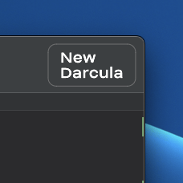
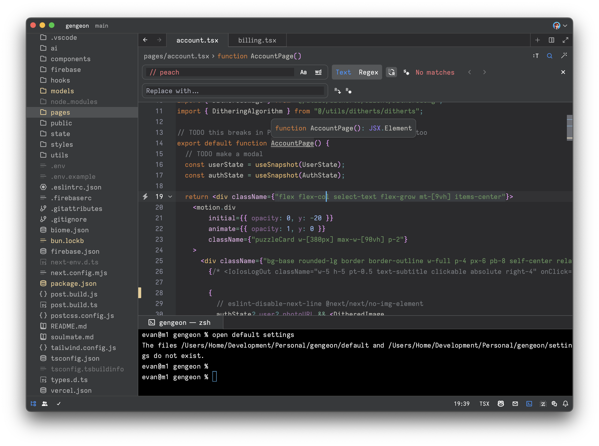

<h3 align="center">
	 
	
	New Darcula for <a href="https://zed.dev/">Zed IDE</a>
</h3>

	</a>

Ultra clean take on the [Jetbrains](https://www.jetbrains.com/) Darcula theme mixed with a hint of GitHub UI. Also available as a [VS Code extension](https://marketplace.visualstudio.com/items?itemName=e-simpson.new-darcula).

## Preview

### Install via Zed Extensions
1. Open Zed
2. `cmd+shift+p` and select *zed: extensions*
3. Search/select *New Darcula Theme* and Install

### Install Manually
1. Download [newdarcula.json](./themes/newdarcula.json)
2. Put into `~/.config/zed/themes/`