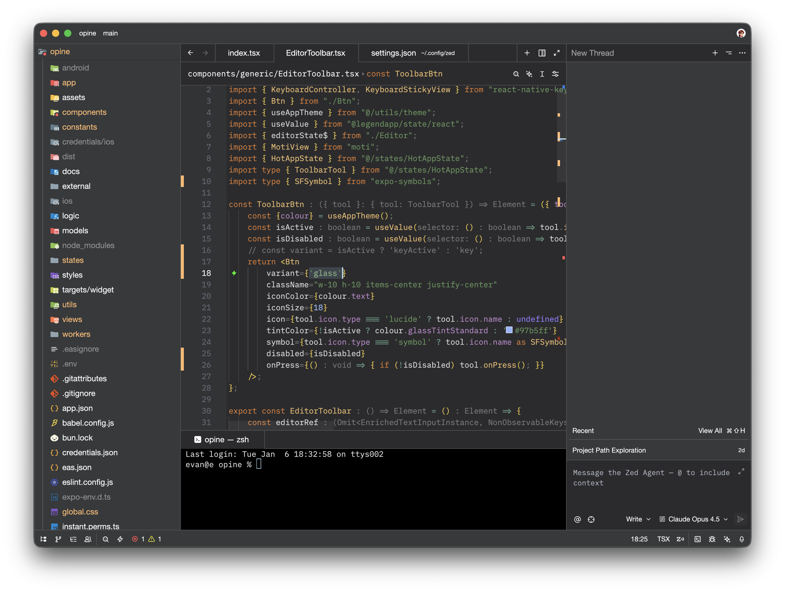
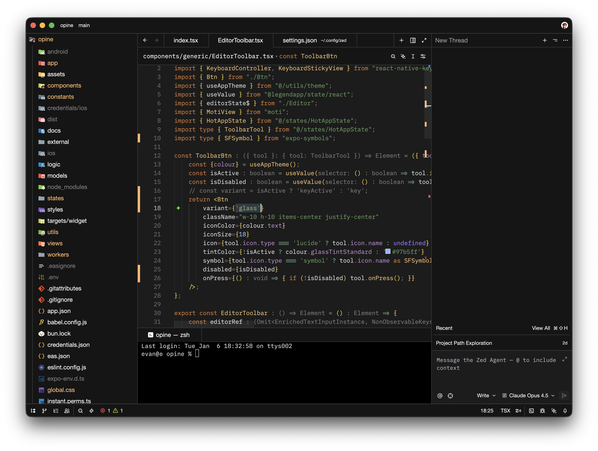
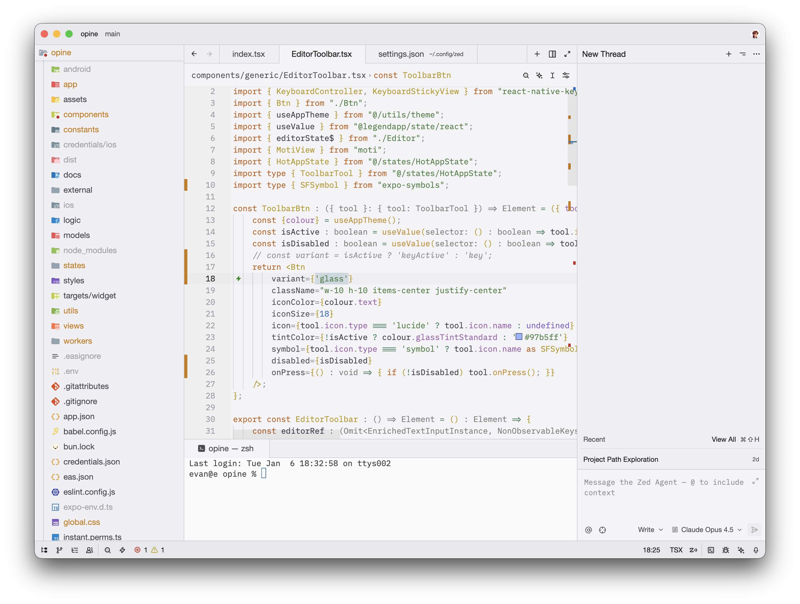

    
    <h3 align="center">New Darcula for <a href="https://zed.dev/">Zed IDE</a></h3>
    

	Clean take on the <a href="https://www.jetbrains.com/">JetBrains</a> Darcula theme. Includes a Dark, Darker, and Light theme.
	     Also available as a <a href="https://marketplace.visualstudio.com/items?itemName=e-simpson.new-darcula">VS Code extension</a>.
         
        

		
        

    

    
    
Standard Darcula

    
    
Darker Darcula

    
    
Light Darcula

### Install via Zed Extensions
1. Open Zed
2. `cmd+shift+p` and select *zed: extensions*
3. Search/select *New Darcula Theme* and Install

### Install Manually
1. Download [newdarcula.json](./themes/newdarcula.json)
2. Put into `~/.config/zed/themes/`
